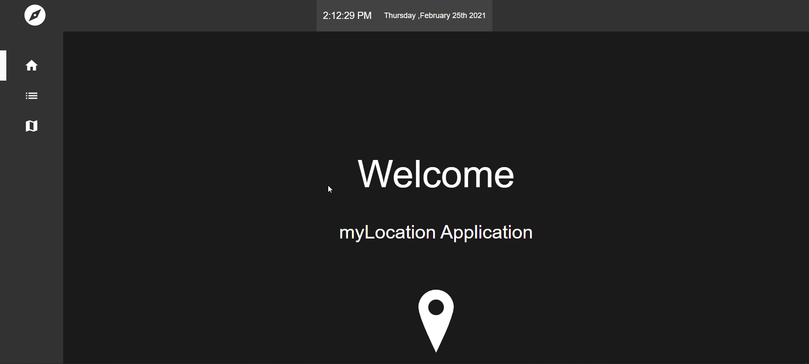
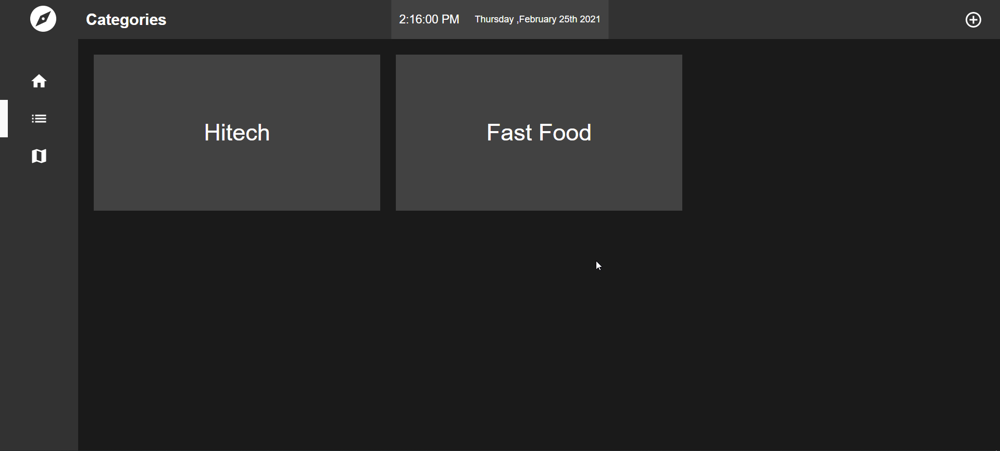
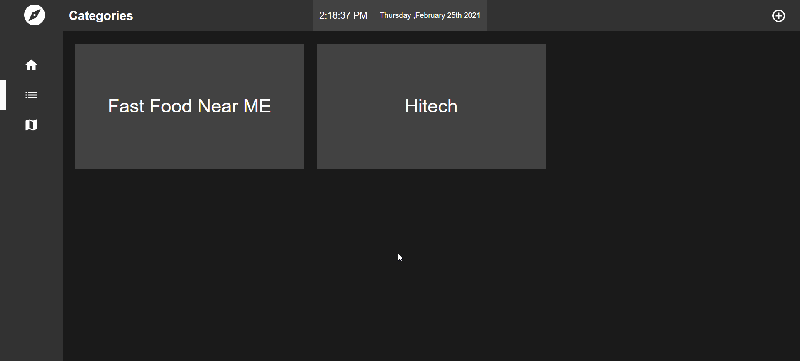
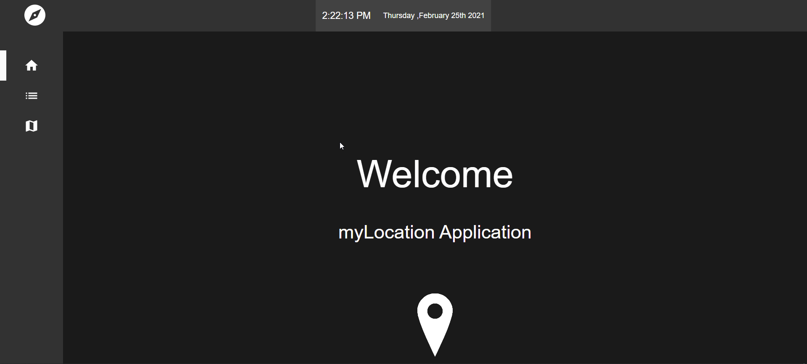
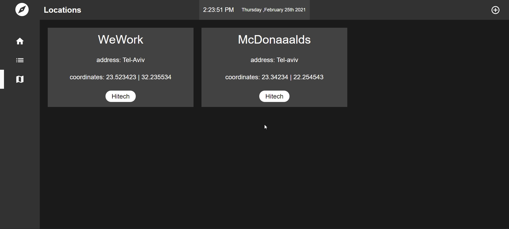

# myLocation-Application

## Info

`Framework` - React.js ,

`State Manager` - Redux

### Central Libraries :

- react-router-dom
- react-transition-group
- Material-UI
- React-Redux
- react-select
- moment
- yup

## DEMO
https://my-locations.vercel.app/

## Sample Application Description

The sample application is called myLocations. It allows the user to maintain a list of categorized
name locations.

The domain model has two main entities: Category and Location.

## Brief introduction to the interface

There is a permanent toolbar at the top, for all screens. It contains a title and actions.

The title and actions update according to context. For example, when the user is in the
“category list” or “new category” screens there is no specific category in the context so it
doesn’t make sense to make the “edit” / “delete” actions available. The title in this case
can be “Categories” and the only available action is “new category”.

If there is a category in context the available actions would be “edit”, “delete”, “view”.

## Categories

Category has a single property: name.

The user can view a list of all existing categories.

When the user chooses a category from the list, it is highlighted, and he can click any of
the actions in the toolbar to manage the category - edit, view details, delete.

### Add

### Remove & Edit

### View

## Locations

Location has the following properties: name, address, coordinates, and category.

The user can view a list of all existing locations.

When the user chooses a location from the list, it is highlighted, and he can click any of
the actions in the toolbar to manage the category - edit, delete.

### Add

Allow relating multiple categories to a single item.

### Remove & Edit

